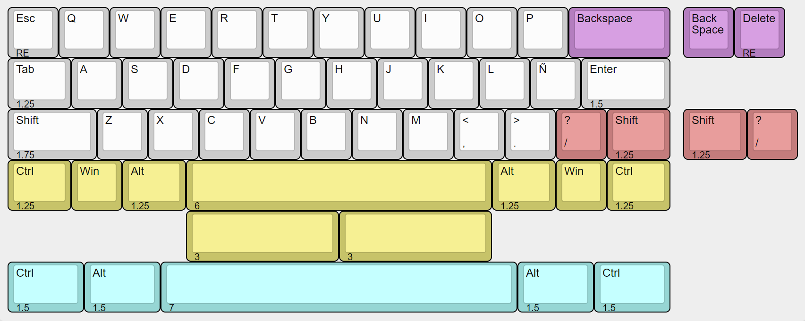

# QS-13u

Un teclado 40% de 13u, diseñado por Quark.Works, inspirado en el layout del Bacca40.

## Layouts

[KLE Link](http://www.keyboard-layout-editor.com/#/gists/edd9330d8816866bf59f697946c975f9)

## Case

QS-13G (gummy worm)

Pendiente, buscar tamaño de oring adecuado

| Qty | Item						| Notes							|
|----:|-------------------------------------------------|-------------------------------------------------------|
|   2	| Tornillo M2.5 x 4 mm						| https://www.mcmaster.com/91290A099/		|
|   4	| Tornillo M2.5 x 10 mm					| https://www.mcmaster.com/91290A103/		|
|   1	| XYZ Unified Daughterboard			| https://github.com/xyzz/xyztkl-r2/tree/main/dboard	|

La version heatset ademas utiliza:
Referencia: https://www.aliexpress.com/item/1005003174906572.html

| Qty | Item						|
|----:|-------------------------------------------------|
|   2	| Insert M2.5 x 3 x 3.5						|
|   4	| Insert M2.5 x 5 x 3.5					|