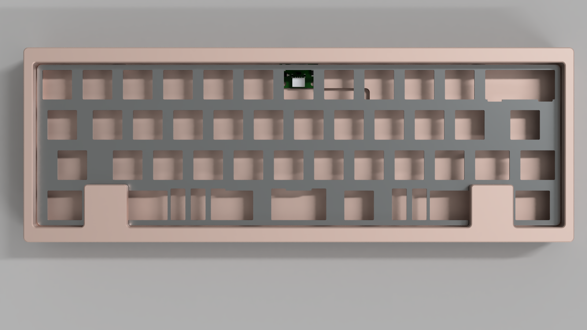

# QS-13u

Un teclado 40% de 13u, diseñado por Quark.Works, inspirado en el layout del Bacca40.

## Layouts

[KLE Link](http://www.keyboard-layout-editor.com/#/gists/edd9330d8816866bf59f697946c975f9)